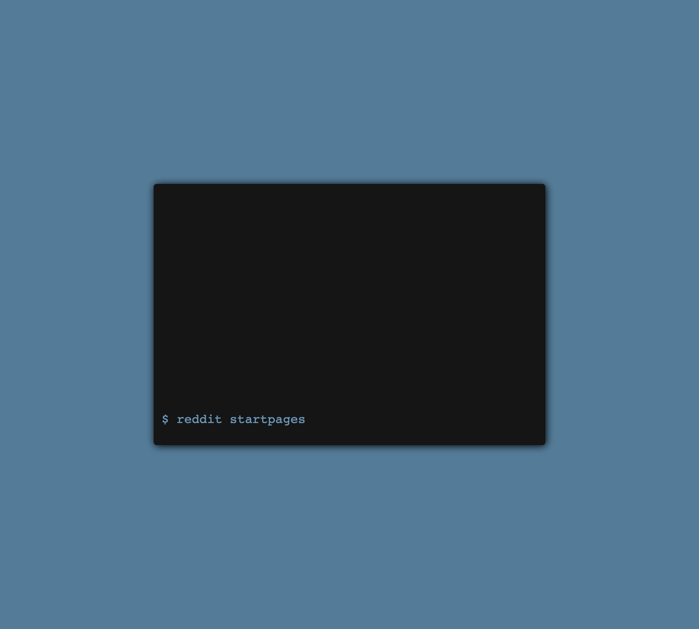

## Terminal Startpage

[](https://GitHub.com/Naereen/StrapDown.js/graphs/commit-activity)


A Startpage that looks like a Terminal.



# Theming

Want to customize the look of your Startpage ?\
We got you covered. You need to edit the terminal.css variables.

```css
:root {
  --main-bg-color: #547c99;
  --prompt-bg-color: #151515;
  --text-color: #6c99bb;
}
```

# Premade commands

reddit [subreddit]\
google [search]\
duckduckgo [search]\
youtube [search]\
github [search]\
wikipedia [search]\
twitch [search]\
imdb [search]\
echo <what_you_want_to_echo>\
clear (or cls)\
ls ( or dir )\
date ( or time )

# How to add commands ?

To add commands, go to the commands.js file in the sources.

add new object to COMMANDS constant

for urls:  
commandAliases: command name + alias list  
url: website domain  
path: if there is some path after domain `ex: https://google.com/[path]?search=foo` (default is an empty string)  
queryName: search query
spaceCharacter: how space was encoded (default: "+")

for methods:  
commandAliases: command name + alias list  
action: method accepts input parameter
